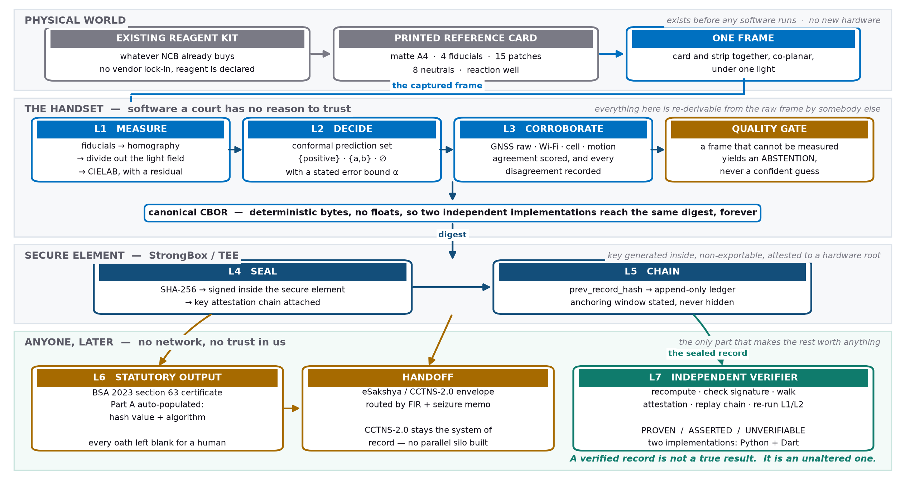
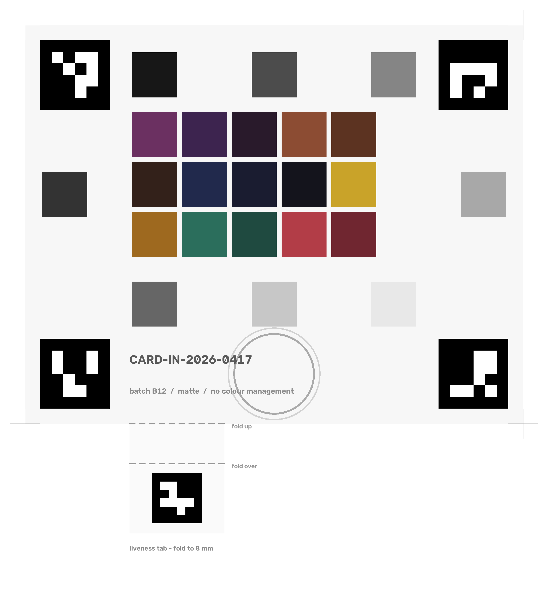

# SIH26231 — Digital Companion for Field Drug Testing

Smart India Hackathon 2026. Ministry of Home Affairs / **Narcotics Control Bureau**.

| Field | Value |
|---|---|
| PS ID | **SIH26231** · Software · MedTech/BioTech/HealthTech |
| Deadline | 30 September 2026 |
| Repository | working documents, a runnable core, and an app |

## The one-paragraph version

The problem statement asks for colour classification plus a tamper-evident record.
Colour classification is an undergraduate exercise, and the naive whole system already
ships commercially (DetectaChem MobileDetect). The real gap — stated in the PS itself —
is that a presumptive field test **is not usable as documentary evidence**. So the
record is the product: a hardware-attested, append-only, independently re-derivable
measurement that emits a Bharatiya Sakshya Adhiniyam §63 certificate and hands off to
MHA's existing eSakshya / CCTNS-2.0 pipeline.

No new hardware. A printed colour card and a phone.

> **The classifier is not the product. The record is.**
> It is one signed input, and it must be able to say "I don't know."

---



*The system, organised by trust boundary rather than by component — who is being
asked to believe what, and on whose word. Full-size and editable in
[`docs/slides/`](docs/slides).*

## How it actually works

A walk through one test, end to end. Every stage below is implemented; the gaps
are marked where they exist.

### 1. The physical setup — no new hardware




An officer has the reagent kit the department already buys, and one **printed
reference card**: matte A4, four ArUco fiducials at the corners, 15 colour patches
spanning the range reagent reactions occupy, 8 neutral greys, a reaction well, and
a **fold-up tab** scored to stand 8 mm above the card.

The card is not decoration. It does four jobs:

| Element | Job |
|---|---|
| 4 corner fiducials | give a homography, so patches are sampled at *known* coordinates rather than hunted for |
| 15 colour patches | let the phone's colour response be solved **in the same frame, under the same light** as the measurement |
| 8 neutral greys | span three rows and five columns, so the illumination field can be fitted *and tested* across the card |
| the fold-up tab | stands proud of the card — a photograph of a card is flat, and cannot fake that |

### 2. Capture — two frames, not one

The strip is placed in the well and photographed **with the card in the same
frame**, twice, from slightly different positions.

Both requirements are load-bearing. Card-and-strip together is what makes the
colour correction valid — you are measuring the strip *relative to known patches
under the same illuminant*. Two frames is what defeats replay.

The shutter is **disabled until the frame is measurable**. A frame that cannot be
measured produces an abstention, never a confident guess, and the guidance names
what to move — *"Move back until all four corner markers are in frame"* — not what
went wrong.

### 3. L1 — turning pixels into a colour measurement

Naive RGB off a phone is not a measurement: ambient light, auto white balance,
auto exposure and undisclosed vendor image processing all move the numbers. So:

1. **Detect** the four fiducials to sub-pixel accuracy.
2. **Rectify** by homography onto a fixed millimetre grid. Patch centres become
   constants.
3. **Fit the light field** from the grey ladder and divide it out — this removes
   the officer's own shadow. Fitted in log space, so it is multiplicative.
4. **Test the light field** against 196 probe points on bare card. Uniform paper
   means any structure left over *is* illumination the fit missed. This is what
   catches a shadow *edge*, which a smooth surface cannot represent.
5. **Solve the device transform** — a root-polynomial least-squares map from the
   phone's RGB to CIEXYZ, fitted against the card's own known patches. Every term
   carries the units of intensity, so the fit does not drift when the officer steps
   into shade.
6. **Sample the reaction well** with a trimmed mean, rejecting specular hits.
7. **Grade the frame**: fiducial count, reprojection residual, tilt, sharpness,
   clipping, dynamic range, light-field residual, within-patch spread. Every one
   of these is written into the record.

Deliberately **no neural network**. A least-squares colour transform is auditable,
explainable to a court, and a defence expert can recompute it on paper. That choice
was tested rather than assumed — see the ablation below.

### 4. L2 — a result that can say "I don't know"

The Lab value is compared against per-reagent **reference loci** using CIEDE2000.
The output is not an argmax — it is a **conformal prediction set**:

- `{positive}` → report positive
- `{positive, amphetamine}` → **inconclusive**, the measurement does not separate them
- `{}` → **inconclusive**, it resembles nothing this reagent is calibrated for

The threshold is calibrated on held-out data with the finite-sample correction, so
the claim is: *at risk level α, on exchangeable data, the true label is in the set
at least 1−α of the time.* That sentence survives cross-examination. "The model was
87% confident" does not.

### 5. Liveness — the two frames earn their keep

Two views of a plane are related exactly by a homography. Rectify both frames on
the card's own fiducials and everything **on the card plane** lands in the same
place. The fold-up tab does not — it is displaced by `b·h/(D−h)` for camera
baseline `b` and distance `D`.

So residual displacement after rectification **is** out-of-plane structure. A flat
reproduction gives **exactly zero**, at any print quality, forever. Measured: a
physical card gives 28.1 px against 28.2 predicted; a photo-lab print gives 0.1 px;
a high-DPI screen gives 0.0 px.

A flat capture is treated as a **refusal**, not an error: the record is still
sealed — deleting it is the attack the ledger exists to stop — and it carries no
result plus the reason.

### 6. L4/L5 — sealing, and what sealing does not prove

The whole measurement is encoded as **canonical CBOR** — deterministic bytes, no
floats, every measured quantity a scaled integer with its scale in the field name.
Two independently written encoders must reach the same bytes, because the digest is
the legal artefact.

Then: `SHA-256` → **signed inside StrongBox or the TEE**, with the key attestation
chain attached. That converts *"an app claims it signed this"* into *"this device's
secure hardware signed this, and here is a chain to a root you already trust"* —
checkable years later without the handset.

`prev_record_hash` links each record to every record before it on that device, so
reordering, deletion and backdated insertion all fork the chain, and a fork is
visible. Anchoring bounds the fabrication window; **the app states that window on
screen** rather than implying certified time it does not have.

### 7. L6 — the statutory output

Section 63 of the Bharatiya Sakshya Adhiniyam 2023 replaced §65B on 1 July 2024.
Its Schedule sets out a two-part certificate, and **both parts must state the hash
value and name the algorithm** — SHA256 is one of the algorithms the Schedule names
on its face.

The app computed exactly that at capture, so Part A is pre-populated the moment the
record seals. Every oath and signature line stays **blank and marked**: an
auto-filled signature is a forgery mechanism.

The record then goes into an **eSakshya / CCTNS-2.0 envelope** routed by FIR and
seizure memo. CCTNS-2.0 stays the system of record — building a second evidence
store would add a surveillance surface and a liability for no benefit.

### 8. L7 — the part that makes the rest worth anything

A separate verifier, with **no network and no trust in the app**, recomputes the
encoding and digest, checks the signature, walks the attestation chain, replays the
hash chain, re-hashes the images, and re-runs L1/L2 from the raw frame to confirm
the stored result was measured rather than written in.

Then it does the thing that makes it forensic rather than a rubber stamp — it sorts
every claim into three buckets and prints all three at equal weight:

| | |
|---|---|
| **PROVEN** | re-derived here, from the bytes, by this program |
| **ASSERTED** | in the record, but nothing in the bundle establishes it — wall-clock time, who was behind the biometric, the operator-declared reagent |
| **UNVERIFIABLE** | outside what any bundle of bytes could establish — *whether the substance photographed is the substance seized* |

It ends: *"A verified record is not a true result. It is an unaltered one."*

**There are two verifiers**, written independently in Python and Dart with no
shared code and no shared dependency — different SHA-256, different ECDSA, different
bignum implementations. They are cross-checked in both directions against committed
vectors. A single implementation agreeing with itself proves nothing.

---

## What is built

```sh
python3 -m venv .venv && .venv/bin/pip install -e core[dev]
.venv/bin/python core/tools/fetch_spectral_data.py   # measured camera sensitivities
./check.sh                                           # everything, both languages
```

### Run it against a real printed card

```sh
.venv/bin/python -m ftr.printable --out card.png     # print at 100%, matte, no colour management
.venv/bin/python core/tools/measure_server.py        # the real pipeline, on localhost:8824

cd app && flutter run -d chrome                      # or: flutter build web && serve build/web
```

Point the camera at the printed card. **The numbers on screen are real** — fiducial
count, tilt, card residual in ΔE, the prediction set, and the two-view liveness
result all come from `ftr.pipeline`, the same code the tests and the verifier run.

A browser has no OpenCV, so the pipeline runs behind a localhost bridge and the app
posts frames to it. On a handset the identical code runs natively over a platform
channel. **The transport is a stand-in for the platform channel; the pipeline is a
stand-in for nothing.** Without the bridge the app falls back to a walkable
simulation and says on screen that the figures are placeholders.

Fold the card's tab up before testing liveness, then try the same test against the
card displayed on a phone screen — that is the replay attack, and it should be
refused.

`./check.sh` runs 278 Python tests, 68 Dart tests, 33 Flutter tests, then asserts the
**two independent verifiers reach the same verdict** on the same chain.

| Command | What it does |
|---|---|
| `core/demo.py --keep DIR` | Photograph three strips, seal them, verify, then run five attacks |
| `ftrverify chain DIR` | The reference verifier — offline, trusting nothing |
| `ftr-printable --out card.png` | The reference card, with the liveness tab fold lines |
| `ftr-ingest survey captures/` | Is a capture set usable, and why is the rest not |
| `ftr-ingest calibrate captures/ --holdout tungsten` | Fit and evaluate on a held-out illuminant |
| `ftr-certificate rec.ftr --bundle out/` | §63 certificate + eSakshya handoff bundle |
| `core/tools/robustness.py` | Sweep 83 failure conditions hunting false accepts |
| `core/tools/parallax_study.py` | The replay defence, and how much depth it needs |
| `core/tools/ablation.py` | Does a learned classifier earn its place (it does not) |

### Numbers that are measured, not claimed

| | |
|---|---|
| **0** | false accepts across an 83-condition stress sweep |
| **0.50 ΔE2000** | median colour error on 28 *real* camera sensitivities under D65 (1.24 under tungsten) |
| **0.0%** | wrong calls under an unseen illuminant — the system abstains instead |
| **0.1 px** | parallax from a photo-lab print, against 28.2 px predicted for a physical card |
| **2** | independently written verifiers that agree, in two languages |
| **398** | automated tests |

**Every one of these is measured on synthetic frames or on measured spectral data.
None is a field accuracy.** No printed card has been photographed. See
[`docs/CAPTURE.md`](docs/CAPTURE.md).

---

## Track status

| Track | State |
|---|---|
| **A** — colour pipeline | **Done and stress-tested.** Fiducials, homography, illumination correction, sampling, quality gate, device transform. Envelope swept over 83 conditions with 0 false accepts after three fixes. |
| **B** — classification | **Done and ablated.** Conformal abstention with the finite-sample correction. Nearest-locus ΔE2000 beat Mahalanobis and logistic regression on held-out illuminants *and* held-out cameras, so L2 stays closed-form — no learned component, no TFLite. |
| **C** — crypto / provenance | **Done twice.** Python and Dart, independently written, cross-checked against shared vectors in both directions. |
| **D** — app | **Built, and it runs standalone.** The whole L1/L2 pipeline and the two-view liveness check run on the handset in pure Dart — no laptop, no network, no native dependency. Signing uses StrongBox with an honest TEE fallback, and the attestation chain reaches the record.  Not yet run on a handset. |
| **E** — legal / statutory | **Emitter built, Schedule transcribed.** Certificates carry the Act's real field labels and tick SHA256 as the Schedule names it. Still stamped DRAFT: the transcription is from a bare-Act repository, not the Gazette. **Remaining: one comparison against the eGazette PDF.** |
| **F** — data | **Deliberately deferred.** Card is printable, ingest tooling and protocol are built, and a real printed card already runs clean through the pipeline (0.27 ΔE, gate PASS). The full capture matrix waits on selection — substituting real data is a data change, not an architecture change, which is what makes deferring it safe. |

Two tasks now gate the submission and **neither is code**: compare the §63 Schedule
against the Gazette, and run the capture matrix. Both are specified in
[`DATA-NEEDED.md`](docs/DATA-NEEDED.md).

---

## Things we got wrong, and fixed

The project's own record of being wrong is worth more than a list of features.

**The threat model claimed a replay defence that did not exist.** §10 row 1 said replay
was beaten because the card must be co-planar and co-illuminated with the strip. A
replay reproduces the *whole scene*, so both are preserved. A photo-lab print and a
high-DPI screen passed every colour check reading as **excellent** captures. Now closed
by two-view parallax against a folded 8 mm liveness tab — print 0.1 px, screen 0.0 px,
both refused. A **synchronised stereo replay** still works and is stated as such.
→ [`PARALLAX.md`](docs/PARALLAX.md)

**The reference card had a latent measurement bug.** All eight neutral patches sat on
one row, leaving the illumination surface unconstrained in *y*. A torch hotspot passed
the quality gate carrying **52 ΔE** of error. Neutrals now span three rows and five
columns, and a test enforces it. → [`ROBUSTNESS.md`](docs/ROBUSTNESS.md)

**The camera simulator was measuring an easier problem.** A per-channel RGB gain cannot
produce metamerism, so every cross-illuminant number taken from it was optimistic.
Replaced with rendering from measured reflectance × measured SPD × measured camera
sensitivity. → [`ROBUSTNESS.md §6`](docs/ROBUSTNESS.md)

**The record schema was incomplete for its own statutory purpose.** Transcribing the
§63 Schedule revealed it asks for Make & Model, Serial Number and IMEI — none of which
the FTR carried. It carried `android_id_hash`, a privacy-preserving identifier, which
is exactly the wrong thing for a form asking for an IMEI. → [`CERTIFICATE.md`](docs/CERTIFICATE.md)

**A reference value was written from memory and was impossible.** A CIEDE2000
conformance figure disagreed with both implementations; a bound on ΔE₀₀ for that colour
pair proved the recalled value could not occur. Reference data is now transcribed or
flagged, never recalled. → [`DETERMINISM.md`](docs/DETERMINISM.md)

---

## Documents

**Design and argument**
- [`TIMELINE.md`](docs/TIMELINE.md) — the build log: what was made, and what testing proved wrong
- [`DATA-NEEDED.md`](docs/DATA-NEEDED.md) — what we still need, **staged: an hour before the internal round, a weekend only if selected**
- [`ARCHITECTURE.md`](docs/ARCHITECTURE.md) — seven layers, the threat model, data strategy, build plan
- [`NOVELTY.md`](docs/NOVELTY.md) — prior art conceded, what survives it, the §3(k) problem
- [`DESIGN.md`](docs/DESIGN.md) — interface spec: tokens, the seven rules every screen obeys
- [`app-prototype.html`](docs/app-prototype.html) — clickable nine-screen prototype

**What was measured**
- [`ROBUSTNESS.md`](docs/ROBUSTNESS.md) — the operating envelope, three defects found, the ablation, and what changed under measured physics
- [`PARALLAX.md`](docs/PARALLAX.md) — the two-view liveness check, the card change it forced, the replay that still works
- [`DETERMINISM.md`](docs/DETERMINISM.md) — what "reproduces bit-for-bit" may actually claim
- [`CERTIFICATE.md`](docs/CERTIFICATE.md) — what the §63 Schedule asks for, and the schema gap it exposed
- [`CAPTURE.md`](docs/CAPTURE.md) — the track F protocol, and the only accuracy claim worth making

**Submission**
- [`SIH26231-idea-submission.pptx`](docs/SIH26231-idea-submission.pptx) / [`.pdf`](docs/SIH26231-idea-submission.pdf) — six slides from the official template
- [`architecture-diagram-brief.md`](docs/architecture-diagram-brief.md) — design brief for the architecture diagram
- [`slides/`](docs/slides) — architecture, pipeline, risk table, impact and evidence graphics

## Code

- [`core/`](core/README.md) — `ftr`: canonical CBOR, the Field Test Record, the append-only
  ledger, the colour pipeline, the parallax defence, the §63 emitter, the capture tooling
  and the reference verifier. **278 tests.**
- [`dart/ftr_verify/`](dart/ftr_verify/README.md) — the **second** verifier and the app's
  sealing path, written independently with no shared code or dependency. **68 tests.**
- [`app/`](app/README.md) — the Flutter client. Capture spine and real sealing; camera and
  StrongBox not wired. **33 tests.**
- [`data/spectral/`](data/spectral/README.md) — measured spectral data: sources, licence,
  and what is still missing (all of the chemistry).

## What we are deliberately not building

A confirmatory test. A conviction-support score. A national database of results —
CCTNS-2.0 stays the system of record, and a parallel silo would add a surveillance
surface and a liability for no benefit. Anything that reduces the accused's ability to
challenge the evidence: every disagreement and quality failure is *in* the record
precisely so the other side can use it.
